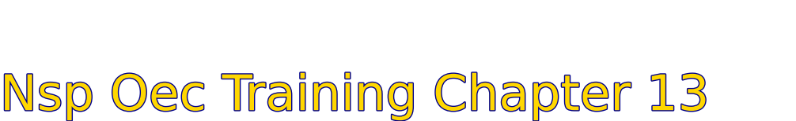

    
# Nsp Oec Training Chapter 13 

## National Ski Patrol - Outdoor Emergency Care chapter 13

    
## Chapter 13: Respiratory Emergencies

1.  Describe the physiology of breathing.
2.  Identify the primary muscle of ventilation.
3.  List the normal respiratory rate for individuals in the following age groups: infant, child, and adult.
4.  Identify the most common cause of airway obstruction.
5.  List the signs and symptoms of respiratory emergencies.
6.  Describe and demonstrate how to assess a patient who is having difficulty breathing.
7.  List the signs and symptoms of acute respiratory distress.
8.  Describe characteristics of abnormal breathing.
9.  Demonstrate how to assess lung sounds.
10. Describe and demonstrate the appropriate management of a patient in respiratory distress.
11. Demonstrate how to assist the patient with an inhaler.

## 13.1.  Describe the physiology of breathing.

The **physiology of breathing**, also known as **respiration**, involves two main processes: **inhalation** (inspiration) and **exhalation** (expiration). These processes allow the body to take in oxygen and expel carbon dioxide.

### 1. **Inhalation (Inspiration)**:
   - **Diaphragm contracts**: The primary muscle involved in breathing, the diaphragm, contracts and moves downward, increasing the space in the chest cavity.
   - **Intercostal muscles contract**: The muscles between the ribs (intercostal muscles) also contract, lifting the ribcage and further expanding the chest cavity.
   - **Air enters the lungs**: The expansion of the chest cavity decreases the pressure inside the lungs compared to the outside air, causing air to flow in through the nose or mouth, down the trachea, and into the lungs.
   - **Gas exchange in alveoli**: Oxygen in the inhaled air passes through the thin walls of the alveoli (tiny air sacs in the lungs) into the bloodstream, while carbon dioxide from the blood is transferred into the alveoli to be exhaled.

### 2. **Exhalation (Expiration)**:
   - **Diaphragm relaxes**: The diaphragm moves upward as it relaxes, reducing the space in the chest cavity.
   - **Intercostal muscles relax**: The ribcage moves downward and inward as the intercostal muscles relax.
   - **Air exits the lungs**: The reduced chest cavity increases pressure in the lungs, causing air to be pushed out of the lungs, through the trachea, and out of the body.
   - **Carbon dioxide is expelled**: The air leaving the lungs contains carbon dioxide, a waste product of cellular metabolism, which is exhaled from the body.

### **Control of Breathing**:
Breathing is primarily controlled by the **medulla oblongata**, a part of the brainstem that monitors carbon dioxide levels in the blood. When carbon dioxide levels rise, signals are sent to the diaphragm and intercostal muscles to increase the breathing rate, ensuring proper oxygen intake and carbon dioxide removal.

This process of breathing is critical for maintaining the body's oxygen supply and removing waste gases, essential for energy production and cellular function.

## 13.2.  Identify the primary muscle of ventilation.

The primary muscle of ventilation is the diaphragm.

Located at the base of the lungs, the diaphragm contracts and moves downward during inhalation, expanding the chest cavity and allowing air to flow into the lungs. During exhalation, the diaphragm relaxes and moves upward, decreasing the space in the chest cavity and forcing air out of the lungs. This rhythmic contraction and relaxation of the diaphragm is essential for effective breathing.

## 13.3.  List the normal respiratory rate for individuals in the following age groups: infant, child, and adult.

Here are the normal respiratory rates for different age groups:

1. **Infant (birth to 1 year)**: 30-60 breaths per minute.
2. **Child (1 to 12 years)**: 18-30 breaths per minute.
3. **Adult (12 years and older)**: 12-20 breaths per minute.

These rates are general guidelines for healthy individuals at rest. Elevated rates may indicate distress or other medical conditions.

## 13.4.  Identify the most common cause of airway obstruction.

The most common cause of airway obstruction is the **tongue** falling back into the throat. This typically occurs when a person is unconscious or in a reduced state of consciousness, such as during sleep, trauma, or medical emergencies, where muscle tone is diminished, and the tongue can block the airway. Other common causes of obstruction include foreign objects (e.g., food), swelling (due to allergic reactions or infections), or trauma to the airway.

## 13.5.  List the signs and symptoms of respiratory emergencies.

Here are the common **signs and symptoms** of respiratory emergencies:

1. **Shortness of breath** or difficulty breathing (dyspnea).
2. **Rapid or shallow breathing** (tachypnea).
3. **Gasping for air** or labored breathing.
4. **Wheezing** or other abnormal breath sounds (e.g., stridor, crackles).
5. **Cyanosis** (bluish discoloration of the lips, skin, or fingernails).
6. **Chest pain** or tightness.
7. **Use of accessory muscles** (neck, chest, or abdomen) to breathe.
8. **Nasal flaring** (common in children).
9. **Coughing** (with or without sputum or blood).
10. **Altered mental status** (e.g., confusion, anxiety, or agitation).
11. **Fatigue or weakness** due to prolonged effort to breathe.
12. **Inability to speak in full sentences** due to breathlessness.
13. **Pale or sweaty skin** (diaphoresis).

These symptoms indicate a respiratory emergency and require immediate medical attention.

## 13.6.  Describe and demonstrate how to assess a patient who is having difficulty breathing.

To assess a patient who is having difficulty breathing, follow these key steps:

### **1. Scene Safety and Initial Assessment:**
- **Ensure scene safety**: Check that it’s safe for you and the patient.
- **Introduce yourself**: Explain that you are trained to help and ask for consent to provide care.
- **Assess the patient’s responsiveness**: Determine if the patient is alert and oriented or in distress.

### **2. Perform a Primary Assessment (ABC):**
- **A – Airway**: Ensure the airway is open and clear. If not, clear any obstructions.
- **B – Breathing**: Check if the patient is breathing adequately:
   - Observe **chest rise**: Is the chest rising normally with each breath?
   - Count the **respiratory rate**: Count the number of breaths in 30 seconds and multiply by two. Normal rates: 
     - Adults: 12-20 breaths per minute
     - Children: 18-30 breaths per minute
     - Infants: 30-60 breaths per minute
   - Assess **depth and effort**: Is the breathing shallow or labored? Are they using accessory muscles?
   - Listen for **abnormal sounds**: Check for wheezing, stridor, or crackles.
   - **Feel for air movement**: Place your cheek near their mouth to feel if air is moving in and out.
- **C – Circulation**: Check for cyanosis (bluish skin) around the lips, fingers, or toes, which indicates poor oxygenation.

### **3. Ask Questions (SAMPLE History):**
To better understand the situation, ask the patient about:
- **S**: Signs and symptoms – "How are you feeling? What are your symptoms?"
- **A**: Allergies – "Do you have any known allergies?"
- **M**: Medications – "Are you taking any medications for breathing issues?"
- **P**: Past medical history – "Have you had any breathing problems in the past?"
- **L**: Last oral intake – "When did you last eat or drink?"
- **E**: Events leading up to the issue – "What were you doing before this started?"

### **4. Perform a Physical Exam:**
- **Observe chest movement**: Watch for symmetry. If one side of the chest moves differently, this could indicate a collapsed lung or injury.
- **Listen with a stethoscope** (if available):
   - Listen to the lungs in various places on the chest and back for abnormal breath sounds like wheezing or crackles.
- **Check for retractions**: Look for sinking of the skin between the ribs or above the collarbones, a sign of labored breathing.
- **Look for nasal flaring or pursed-lip breathing**, which indicates difficulty breathing.

### **5. Monitor Oxygen Saturation (if equipment is available):**
- Use a pulse oximeter to check the patient’s oxygen saturation level. Normal levels should be between 95-100%. Levels below 90% indicate a serious issue.

### **6. Provide Appropriate Care:**
- **Position the patient**: Help the patient sit up in a position that makes breathing easier, such as in a Fowler’s or semi-Fowler’s position.
- **Administer oxygen** (if trained and equipment is available): Use a non-rebreather mask or nasal cannula if the patient has low oxygen levels.
- **Call for advanced medical help** if the condition is severe or worsening.

This assessment focuses on ensuring adequate breathing and quickly identifying respiratory distress signs so that proper care can be given.

## 13.7.  List the signs and symptoms of acute respiratory distress.

Here are the common signs and symptoms of **acute respiratory distress**:

1. **Severe shortness of breath** or difficulty breathing (dyspnea).
2. **Rapid breathing** (tachypnea) or shallow breaths.
3. **Labored breathing** with use of accessory muscles (neck, chest, or abdomen).
4. **Wheezing** or other abnormal breath sounds (e.g., crackles, stridor).
5. **Cyanosis** (bluish tint to the lips, skin, or fingernails) due to low oxygen levels.
6. **Chest tightness** or pain.
7. **Panic, anxiety, or restlessness** due to the inability to breathe effectively.
8. **Fatigue or weakness** from prolonged effort to breathe.
9. **Nasal flaring** (common in children) or pursed-lip breathing.
10. **Coughing** (may be dry or produce frothy or bloody sputum).
11. **Altered mental status**, confusion, or dizziness due to low oxygen supply.
12. **Inability to speak in full sentences** because of breathlessness.
13. **Profuse sweating** (diaphoresis).

These signs and symptoms indicate a medical emergency that requires immediate attention to restore proper oxygenation and breathing.

## 13.8.  Describe characteristics of abnormal breathing.

Here are the key characteristics of **abnormal breathing**:

1. **Increased or Decreased Respiratory Rate**:
   - **Tachypnea**: Rapid breathing, typically more than 20 breaths per minute in adults.
   - **Bradypnea**: Abnormally slow breathing, fewer than 12 breaths per minute in adults.

2. **Shallow Breathing**: Breaths that are weak or insufficient to bring adequate oxygen into the lungs.

3. **Labored Breathing**: Breathing that requires extra effort, often noticeable by the use of accessory muscles (e.g., neck, shoulders, abdomen).

4. **Irregular Breathing Patterns**:
   - **Cheyne-Stokes**: Cycles of increasing and decreasing depth of breathing with periods of apnea (no breathing).
   - **Kussmaul’s Breathing**: Deep, rapid breathing typically associated with metabolic acidosis.

5. **Noisy Breathing**:
   - **Wheezing**: A high-pitched whistling sound, often due to narrowed airways (e.g., asthma, COPD).
   - **Stridor**: A harsh, crowing sound, often indicating upper airway obstruction.
   - **Crackles (Rales)**: A crackling or popping sound, often heard in lung conditions like pneumonia or heart failure.
   - **Gurgling**: Caused by fluid or mucus in the airways.

6. **Cyanosis**: A bluish tint to the skin, lips, or fingernails, indicating poor oxygenation.

7. **Inability to Speak Full Sentences**: The person may need to pause frequently to catch their breath while talking.

8. **Nasal Flaring**: Widening of the nostrils during breathing, commonly seen in respiratory distress, especially in children.

9. **Chest Retractions**: Sinking of the skin between the ribs or at the neck during inhalation, indicating difficulty breathing.

10. **Pursed-Lip Breathing**: Seen in conditions like COPD, where patients exhale slowly through pursed lips to keep airways open.

These characteristics signal that the body's ability to breathe and oxygenate properly is compromised, often requiring immediate medical intervention.

## 13.9.  Demonstrate how to assess lung sounds.

## 13.10. Describe and demonstrate the appropriate management of a patient in respiratory distress.

## 13.11. Demonstrate how to assist the patient with an inhaler.

## Getting Started

The goal of this solution is to **Jump Start** your development and have you up and running in 30 minutes. 

To get started with the **Nsp Oec Training Chapter 13** solution repository, follow these steps:
1. Clone the repository to your local machine.
2. Install the required dependencies listed at the top of the notebook.
3. Explore the example code provided in the repository and experiment.
4. Run the notebook and make it your own - **EASY !**
    ## Getting Started
## Solution Features

- Easy to understand and use  
- Easily Configurable 
- Quickly start your project with pre-built templates
- Its Fast and Automated
- Saves You Time 

## Code Features

These features are designed to provide everything you need for **Nsp Oec Training Chapter 13** 

- **Self Documenting** - Automatically identifes major steps in notebook 
- **Self Testing** - Unit Testing for each function
- **Easily Configurable** - Easily modify with **config.INI** - keyname value pairs
- **Includes Talking Code** - The code explains itself 
- **Self Logging** - Enhanced python standard logging   
- **Self Debugging** - Enhanced python standard debugging
- **Low Code** - or - No Code  - Most solutions are under 50 lines of code
- **Educational** - Includes educational dialogue and background material

    
## List of Figures
    
    

## Github https://github.com/JoeEberle/ - Email  josepheberle@outlook.com 
    

    